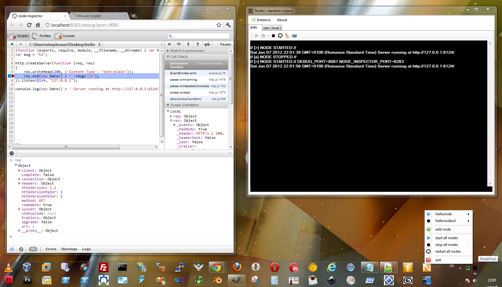

nodepool
===

### Description

Nodepool is nodejs + npm + nodeinspector distribution for windows 7. Its goal is to speed up development of nodejs applications on windows.

Think of it as the [wamp](http://wampserver.com/en/) or [xampp](http://www.apachefriends.org/fr/xampp.html) distribution but for nodejs app development.

NodePool is NOT a text editor/ide but plays nice with any text editor/ide.

### Changelog

						
+ Version 0.1.0 - alpha - 2012.01.07
	+ Better output console ui: Run/Debug/Stop/Restart/ClearConsole/OpenInExplorer buttons
	+ Npm console: Npm commands are directly executed in main js script's folder
	+ One click debug feature with node inspector (experimental)
	+ nodejs updated to 0.6.6 (npm included)
	+ nodeinspector updated to 0.1.10
	+ tested on windows 7 only
	

+ Version 0.0.1 - alpha - 2011.02.17
	+ Initial release
	+ Can add node instances
	+ Node instances can be asked to restart automaticly when source code is updated
	+ Node instances can be asked to restart automatilcy in case of crash
	+ Start/Restart/Stop instances one by one or all in same time from windows systray
	+ Watch standart output od each instance in separate window
	+ nodejs0.4.0 is included
			